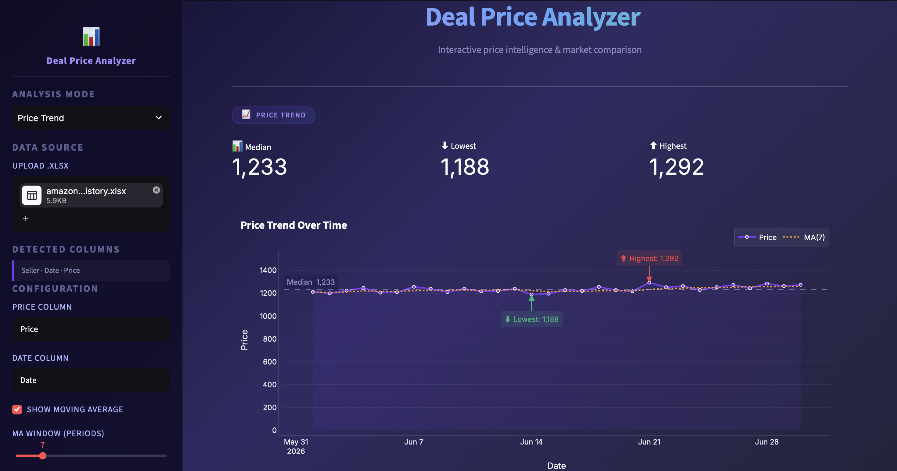

# Deal Price Analyzer

I'm building this to learn pandas, Plotly, Streamlit, and eventually scikit-learn by working on a project I'd actually use, instead of following disconnected tutorials. It started as a terminal script for comparing prices, and has gradually turned into an interactive dashboard for exploring commodity and supplier pricing data.

## Screenshot



## How it works

Run the Streamlit app and upload an Excel file. The dashboard currently supports two analysis modes:

* **Seller Comparison** — Compare prices across multiple sellers against a base price.
* **Price Trend** — Track how a price changes over time and explore the distribution of those prices.

### Seller Comparison

Upload an Excel file containing seller and price data.

The dashboard:

* Calculates median, lowest, and highest prices.
* Calculates margin percentage against a base price.
* Sorts sellers from cheapest to most expensive.
* Displays an interactive Plotly bar chart.
* Color-codes sellers based on how far they are from the base price.
* Includes a separate margin breakdown chart.
* Shows the underlying data in a sortable table.

I still use the median rather than the average here. One unusually high or low price can distort an average significantly, while the median tends to give a more realistic picture of the market.

### Price Trend

Upload an Excel file containing dates and prices.

The dashboard:

* Converts and sorts dates automatically.
* Calculates median, lowest, and highest prices.
* Displays an interactive time-series chart.
* Highlights the lowest and highest recorded prices.
* Supports an optional moving average.
* Includes a price distribution histogram.
* Includes a box plot for quick outlier detection.
* Shows the processed data in a table.

All charts are interactive and support hover tooltips for inspecting exact values.

### Error Handling

The app handles:

* Missing files.
* Invalid Excel files.
* Missing columns.
* Incorrect column names.

Instead of crashing, it explains the problem and shows the available columns where possible.

## Sample files

Currently using manually prepared Excel files during development.

Planned:

* `sample_sellers.xlsx`
* `sample_price_history.xlsx`

so the dashboard can be tested immediately after cloning.

## Requirements

```bash
pip install streamlit pandas openpyxl plotly
```

## Usage

```bash
streamlit run app.py
```

## Where this is at

### v0.1

* Manual terminal input.
* Python `statistics` module.

### v0.2

* Moved to pandas.
* Excel file input.

### v0.3

* Added Matplotlib visualizations.

### v0.4

* Split into Seller Comparison and Price Trend modes.
* Added margin analysis.
* Added hover tooltips.

### Current Version

* Migrated from terminal application to Streamlit.
* Rebuilt visualizations using Plotly.
* Added interactive dashboard UI.
* Added moving averages.
* Added distribution analysis using histograms and box plots.
* Added improved error handling and data exploration tools.

## What's next

A few ideas are already on the list:

* Better column selection using dropdown menus instead of manual text entry.
* Sample datasets bundled with the project.
* Exporting filtered results and reports.
* Benchmarking against reference market prices instead of a manually entered base price.
* Seller performance tracking over time.
* More advanced pandas analysis using `groupby`.
* Scikit-learn experiments for basic forecasting once enough historical data exists.

The longer-term goal is still the same: learn data analysis and machine learning by building something useful instead of treating each library as a separate tutorial.

## License

Not decided yet.

